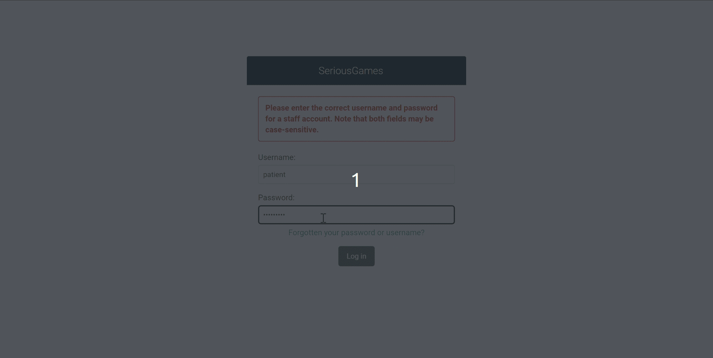
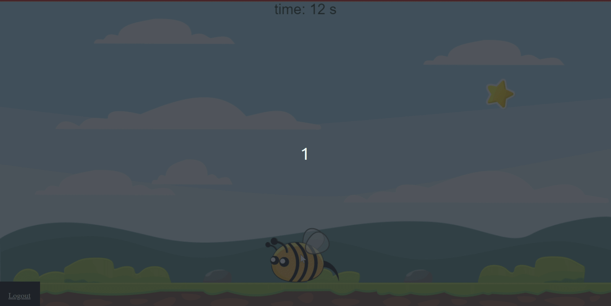
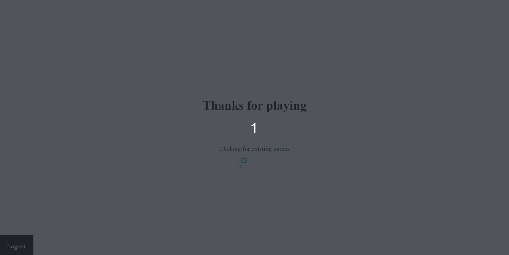

# SeriousGames platform

Platform dedicated to therapist and post stroke patients. Allows patients to play games and therapists to follow patients score and change game parameteres.

Two games where developed using Vanilla js. And backend using Django 3.2.

[More info](Report/Development%20of%20a%20cognitive%20rehabilitation%20Web%20application%20for%20post-stroke%20patients.pdf)

# Demo

## Game 1 part 1

## Game 1 part 2

## Game 3

# Test it yourself

Web app available on: [SeriousGames](https://fatben.pythonanywhere.com/)

Until Wednesday 02 October 2024

Accounts:

- Therapist's account:

username: therapist

password: myP@ass99

- Patient's account:

username: user1111

password: P0assw0rd 
